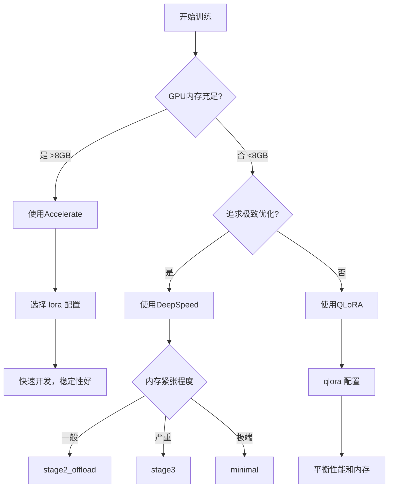

# Accelerate vs DeepSpeed 训练对比分析

本文档详细对比了Hugging Face Accelerate和Microsoft DeepSpeed两种训练框架的差异，帮助选择最适合的训练方式。

## 🏗️ 框架层次结构

在深度学习训练中，存在多个抽象层次：

```
📱 用户接口层: ./run_train.sh -t [配置类型]
         ↓
🎛️ 配置层: train_config_*.json
         ↓  
🚀 训练API层: Hugging Face Trainer
         ↓
⚡ Backend层: Accelerate Backend  ←→  DeepSpeed Backend
         ↓                              ↓
🔧 底层实现: PyTorch DDP, FSDP       ZeRO-1/2/3, CPU Offload
```

**重要说明**: 我们项目使用Trainer API，可以通过配置选择底层使用Accelerate还是DeepSpeed。

## 📋 概念定位

### Accelerate
- **定位**: 通用分布式训练抽象层
- **开发者**: Hugging Face
- **核心理念**: 简化分布式训练，提供统一API
- **设计目标**: 让单GPU代码无缝扩展到多GPU/多节点

### DeepSpeed
- **定位**: 专业深度学习优化系统
- **开发者**: Microsoft
- **核心理念**: 极致内存和计算优化
- **设计目标**: 训练超大规模模型，突破硬件限制

## 🔧 技术架构对比

| 特性 | Accelerate | DeepSpeed |
|------|------------|-----------|
| **抽象层级** | 高层抽象，简化API | 低层优化，精细控制 |
| **学习曲线** | 平缓，易上手 | 陡峭，需要深入理解 |
| **灵活性** | 高，支持多种后端 | 中等，专注优化 |
| **优化深度** | 中等，通用优化 | 深度，专业优化 |

## 💾 内存优化策略

### Accelerate 内存优化
```python
# 基本混合精度
accelerator = Accelerator(mixed_precision="fp16")

# 梯度累积
accelerator = Accelerator(gradient_accumulation_steps=4)

# CPU offload（有限支持）
accelerator = Accelerator(cpu=True)
```

**特点:**
- ✅ 简单易用的混合精度
- ✅ 自动梯度同步
- ✅ 支持多种硬件后端
- ❌ 内存优化策略相对有限
- ❌ 缺乏深度内存管理

### DeepSpeed 内存优化
```python
# ZeRO Stage 配置
{
    "zero_optimization": {
        "stage": 3,                    # 参数分片
        "offload_optimizer": {         # 优化器CPU卸载
            "device": "cpu"
        },
        "offload_param": {             # 参数CPU卸载
            "device": "cpu"
        }
    }
}
```

**特点:**
- ✅ ZeRO技术突破内存瓶颈
- ✅ 多级CPU offload
- ✅ 动态精度缩放
- ✅ 激活检查点优化
- ❌ 配置复杂
- ❌ 学习成本高

## ⚡ 性能表现对比

### 训练速度

| 场景 | Accelerate | DeepSpeed | 优势方 |
|------|------------|-----------|--------|
| **单GPU** | 快 | 中等 | Accelerate |
| **多GPU同步** | 快 | 快 | 平手 |
| **大模型训练** | 慢/OOM | 快 | DeepSpeed |
| **内存受限** | 受限 | 优秀 | DeepSpeed |

### 内存使用

| 模型大小 | Accelerate | DeepSpeed ZeRO-2 | DeepSpeed ZeRO-3 |
|----------|------------|------------------|------------------|
| **小模型 (<1B)** | 2-4GB | 1-3GB | 1-2GB |
| **中模型 (1-7B)** | 8-16GB | 4-8GB | 2-4GB |
| **大模型 (7B+)** | OOM | 8-16GB | 4-8GB |

## 🎯 适用场景分析

### 选择 Accelerate 的场景
```python
# 1. 快速原型开发
accelerator = Accelerator()
model, optimizer, train_dataloader = accelerator.prepare(
    model, optimizer, train_dataloader
)

# 2. 多平台兼容
# 支持CPU、GPU、TPU、Apple Silicon

# 3. 简单分布式训练
# 无需复杂配置，自动处理分布式逻辑
```

**适用于:**
- 🎯 快速实验和原型开发
- 🎯 中小型模型训练
- 🎯 需要跨平台兼容
- 🎯 团队技术水平一般
- 🎯 不需要极致内存优化

### 选择 DeepSpeed 的场景
```python
# 1. 大模型训练
{
    "train_batch_size": 32,
    "zero_optimization": {
        "stage": 3,
        "offload_optimizer": {"device": "cpu"},
        "offload_param": {"device": "cpu"}
    }
}

# 2. 内存受限环境
# ZeRO技术可以在有限GPU内存上训练大模型

# 3. 生产环境训练
# 精细优化，最大化硬件利用率
```

**适用于:**
- 🎯 大规模模型训练 (>1B参数)
- 🎯 GPU内存严重受限
- 🎯 追求极致性能
- 🎯 生产环境部署
- 🎯 有专业工程师团队

## 🔄 在Qwen微调项目中的应用

### 当前项目架构

我们的项目使用 **Hugging Face Trainer API** 作为训练框架，Trainer底层可以使用不同的Backend：

```python
# 当前项目使用的训练架构
trainer = Trainer(
    model=model,
    args=training_args,  # 包含deepspeed配置
    train_dataset=train_dataset,
    eval_dataset=eval_dataset,
    tokenizer=tokenizer,
    data_collator=data_collator,
)
```

#### 1. Trainer + Accelerate Backend (默认)
```bash
# 使用标准LoRA配置
./run_train.sh -t lora

# 对应配置文件
{
    "use_deepspeed": false,
    "use_lora": true,
    "per_device_train_batch_size": 4
}
```

#### 2. Trainer + DeepSpeed Backend
```bash
# 使用DeepSpeed优化配置
./run_train.sh -t stage2_offload

# 对应配置文件
{
    "use_deepspeed": true,
    "deepspeed_stage": 2,
    "cpu_offload": true
}
```

### 性能对比实测

| 配置 | 框架 | GPU内存 | 训练速度 | 稳定性 | 推荐度 |
|------|------|---------|----------|--------|--------|
| `lora` | Accelerate | 6-8GB | 快 | 高 | ⭐⭐⭐⭐⭐ |
| `qlora` | Accelerate | 4-6GB | 中 | 高 | ⭐⭐⭐⭐ |
| `deepspeed` | DeepSpeed | 4-8GB | 快 | 中 | ⭐⭐⭐⭐ |
| `stage2_offload` | DeepSpeed | 3-6GB | 中快 | 中 | ⭐⭐⭐⭐⭐ |
| `stage3` | DeepSpeed | 2-4GB | 中 | 低 | ⭐⭐⭐ |
| `minimal` | DeepSpeed | 1-3GB | 慢 | 低 | ⭐⭐ |

## 💡 选择建议

### 快速决策流程图



### 具体建议

#### 🚀 新手推荐
```bash
# 第一选择：Accelerate + LoRA
./run_train.sh -t lora

# 内存不足时：QLoRA
./run_train.sh -t qlora
```

#### 🔧 进阶用户
```bash
# 平衡性能：DeepSpeed Stage 2 + Offload
./run_train.sh -t stage2_offload

# 极限内存：DeepSpeed Stage 3
./run_train.sh -t stage3
```

#### 🏭 生产环境
```bash
# 多GPU训练
./run_train.sh -t deepspeed

# 配合专业监控和调优
```

## 🔍 技术细节对比

### 实现原理

#### Accelerate工作流程
```python
# 1. 统一抽象
accelerator = Accelerator()

# 2. 自动设备管理
model = accelerator.prepare(model)

# 3. 梯度同步
accelerator.backward(loss)

# 4. 跨平台兼容
# 相同代码在CPU/GPU/TPU上运行
```

#### DeepSpeed工作流程
```python
# 1. 引擎初始化
model_engine, optimizer, _, _ = deepspeed.initialize(
    model=model,
    config=ds_config
)

# 2. ZeRO分片
# 参数自动分片到多个GPU

# 3. 内存优化
# CPU offload、激活检查点等

# 4. 专业优化
# 通信重叠、精度管理等
```

### 内存管理机制

#### Accelerate内存管理
- **混合精度**: FP16/BF16自动转换
- **梯度累积**: 减少显存峰值
- **设备管理**: 自动CPU/GPU数据移动
- **限制**: 缺乏深度内存优化

#### DeepSpeed内存管理
- **ZeRO-1**: 优化器状态分片
- **ZeRO-2**: 梯度分片
- **ZeRO-3**: 参数分片
- **CPU Offload**: 智能数据卸载
- **激活检查点**: 重计算节省内存

## 📈 性能调优指南

### Accelerate调优
```python
# 1. 混合精度优化
accelerator = Accelerator(mixed_precision="fp16")

# 2. 梯度累积调优
# 增加累积步数，减少显存使用
gradient_accumulation_steps = 8

# 3. 数据加载优化
dataloader = DataLoader(
    dataset, 
    batch_size=batch_size,
    num_workers=4,
    pin_memory=True
)
```

### DeepSpeed调优
```json
{
    "train_batch_size": 32,
    "gradient_accumulation_steps": 4,
    "zero_optimization": {
        "stage": 2,
        "allgather_partitions": true,
        "allgather_bucket_size": 5e8,
        "overlap_comm": true,
        "reduce_scatter": true,
        "reduce_bucket_size": 5e8,
        "contiguous_gradients": true
    },
    "fp16": {
        "enabled": true,
        "loss_scale": 0,
        "loss_scale_window": 1000,
        "hysteresis": 2,
        "min_loss_scale": 1
    }
}
```

## 🚨 常见问题和解决方案

### Accelerate常见问题
1. **跨平台兼容性问题**
   - 解决：使用`accelerator.device`获取正确设备
   
2. **内存不足**
   - 解决：减少batch_size，增加gradient_accumulation_steps

3. **多GPU同步问题**
   - 解决：使用`accelerator.gather()`正确收集分布式结果

### DeepSpeed常见问题
1. **配置复杂**
   - 解决：从简单配置开始，逐步优化
   
2. **版本兼容性**
   - 解决：使用指定版本`deepspeed==0.9.0`

3. **ZeRO Stage 3不稳定**
   - 解决：从Stage 2开始，确认稳定后升级

## 📝 总结

### 核心差异
- **Accelerate**: 简单易用，通用性强，适合快速开发
- **DeepSpeed**: 性能极致，专业优化，适合大规模训练

### 选择原则
1. **简单优先**: 优先选择Accelerate，满足需求即可
2. **内存受限**: GPU内存不足时选择DeepSpeed
3. **生产环境**: 追求极致性能时选择DeepSpeed
4. **团队能力**: 考虑团队技术水平和维护成本

### 推荐配置
- **日常使用**: `./run_train.sh -t lora` (Accelerate)
- **内存优化**: `./run_train.sh -t stage2_offload` (DeepSpeed)
- **极限情况**: `./run_train.sh -t minimal` (DeepSpeed)

通过合理选择训练框架，可以在性能、内存使用和开发效率之间找到最佳平衡点。 